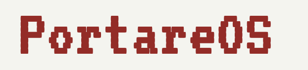

# PortareOS

**PortareOS is a personal fork of [ROCKNIX](https://github.com/ROCKNIX/distribution), for the Retroid Pocket Nova and nothing else.**

Home: **[os.portare.org](https://os.portare.org)**

ROCKNIX is an immutable Linux distribution for handheld gaming devices, developed by a community of enthusiasts, and is itself a fork of [JELOS](https://github.com/JustEnoughLinuxOS/distribution). Nearly all of the work that makes this project possible is theirs. PortareOS adds a layer of device-specific tuning on top and removes everything that is not the Nova.

## What this fork is for

The Nova has a **1280x960 (4:3) 120Hz panel** and sits alongside the Retroid Pocket 6 in ROCKNIX's SM8550 platform, sharing its device tree and its emulator configuration. That sharing is sensible upstream, since they are the same SoC, but it means a number of defaults written for the RP6's 1920x1080 16:9 display land unexamined on the Nova.

This fork exists to correct that, and to carry Nova-specific work that would not make sense upstream:

* Panel and display tuning for 1280x960, covering render resolutions and integer scaling for the systems whose native height divides cleanly into 960.
* Deep suspend enabled for the Nova.
* microSD at UHS-I SDR104 rather than legacy High Speed.
* Input latency work across the gamepad, compositor and emulator frame queue.
* `sched_ext` with `scx_lavd`, the latency-aware scheduler, for frame pacing across the Nova's big.LITTLE layout.

Several of the kernel patches behind those come from [pocknix-os](https://github.com/shuuri-labs/pocknix-os) rather than from this fork. See Credits.

## Relationship to upstream

This fork has diverged deliberately and does not track upstream closely.

Everything that is not SM8550 has been removed from the tree: the other twelve device trees, the nine non-ROCKNIX hardware projects inherited from the LibreELEC lineage, the LEIoT and LibreELEC distributions, Kodi, and the unbuilt addon set. The in-tree identifiers are renamed to PortareOS, and [emulationstation-next](https://github.com/portare-ch/emulationstation-next) is built from a fork rather than from ROCKNIX's copy.

The practical consequence is that merging from upstream now takes real work, and that is an accepted trade. Individual fixes here may still be worth offering upstream on their own; the tree as a whole is not.

Sources are still fetched from ROCKNIX's `distribution-sources` mirror, and several components are still built from ROCKNIX's repositories. Those are dependencies, not branding, and they keep their names.

**Please do not raise PortareOS problems with the ROCKNIX maintainers.** For the upstream project, its community and its documentation, go to **[rocknix.org](https://rocknix.org)** and the [ROCKNIX Discord](https://discord.gg/seTxckZjJy).

## Features

Inherited from ROCKNIX:

* Integrated cross-device local and remote network play.
* In-game touch support.
* Fine grain control for battery life or performance.
* Support for playing music and video.
* Bluetooth audio and controller support.
* Support for HDMI audio and video out, and USB audio.
* Device to device and device to cloud sync with Syncthing and rclone.
* VPN support with Wireguard, Tailscale, and ZeroTier.
* Built-in support for scraping and retroachievements.

## Building

```
make docker-SM8550
```

Images are written to `target/`. The build wants a container runtime, roughly 100 GB of disk and several hours the first time through.

Two options worth knowing about:

* The **Build** workflow takes an `incremental` input. Off, it builds everything, which is what scheduled and release builds always do. On, it restores per-stage state and skips packages whose recipes have not changed.
* `.github/scripts/check-package-deps.py` checks that every package named in a `PKG_DEPENDS_*` line exists, resolving variable-driven lists such as `PKG_EMUS` and `LIBRETRO_CORES`. It runs early in CI so a missing package fails in seconds rather than part-way through a build.

## Installing

PortareOS uses its own boot partition label, so the first image must be written to the card as a fresh install. An in-place update over an existing ROCKNIX installation will not find its boot partition. Updates between PortareOS builds work normally.

Installation steps are at [os.portare.org](https://os.portare.org).

## Licenses

**PortareOS** is a fork of **ROCKNIX**, which is a fork of [JELOS](https://github.com/JustEnoughLinuxOS/distribution). All licenses apply, and credit belongs to the ROCKNIX and JELOS teams.

### ROCKNIX Branding

ROCKNIX branding and images are licensed under a [Creative Commons Attribution-NonCommercial-ShareAlike 4.0 International License](https://creativecommons.org/licenses/by-nc-sa/4.0/).

You are free to:

- Share: copy and redistribute the material in any medium or format
- Adapt: remix, transform, and build upon the material

Under the following terms:

- Attribution: You must give appropriate credit, provide a link to the license, and indicate if changes were made. You may do so in any reasonable manner, but not in any way that suggests the licensor endorses you or your use.
- NonCommercial: You may not use the material for commercial purposes.
- ShareAlike: If you remix, transform, or build upon the material, you must distribute your contributions under the same license as the original.

### ROCKNIX Software

Copyright (C) 2024-present [ROCKNIX](https://github.com/ROCKNIX)

Original software and scripts developed by the ROCKNIX team are licensed under the terms of the [GNU GPL Version 2](https://choosealicense.com/licenses/gpl-2.0/). The full license can be found in this project's licenses folder.

### Bundled Works

All other software is provided under each component's respective license. These licenses can be found in the software sources or in this project's licenses folder. Modifications to bundled software and scripts by the ROCKNIX and JELOS teams are licensed under the terms of the software being modified.

## Credits

Like any Linux distribution, this project is not the work of one person. It is the work of many people all over the world who have developed the open source bits without which this project could not exist. Special thanks to ROCKNIX, JELOS, CoreELEC, LibreELEC, and to developers and contributors across the open source community.

### Patches from pocknix-os

A number of the SM8550 kernel patches carried here were taken from
[pocknix-os](https://github.com/shuuri-labs/pocknix-os) by shuuri-labs, either unchanged
or with only the rebasing needed to fit this tree. Authorship is preserved in each patch
header; the work is theirs, and any mistakes in adapting it are mine.

| Patch | What it does |
| --- | --- |
| `0210`, `0211`, `0212` | microSD at UHS-I SDR104 via the downstream `sdhci-msm` driver, plus the `sdhc_2` rebind in the RP6 device tree. Originally from Armbian PR #9546 (Alex Ling). |
| `1012` | rsinput MCU version handshake on init, so the gamepad survives an unlucky resume (jaewun). |
| `1021` | Expose only the 120Hz mode on the RP6 panel (pocknix). `1022` is this fork's port of it to the Nova panel. |
| `1050` | `edt,retain-power-in-suspend` option for edt-ft5x06 (jaewun). |
| `1051` | Lowest A740 GPU operating point, 124.8 MHz (Thorch contributors). |
